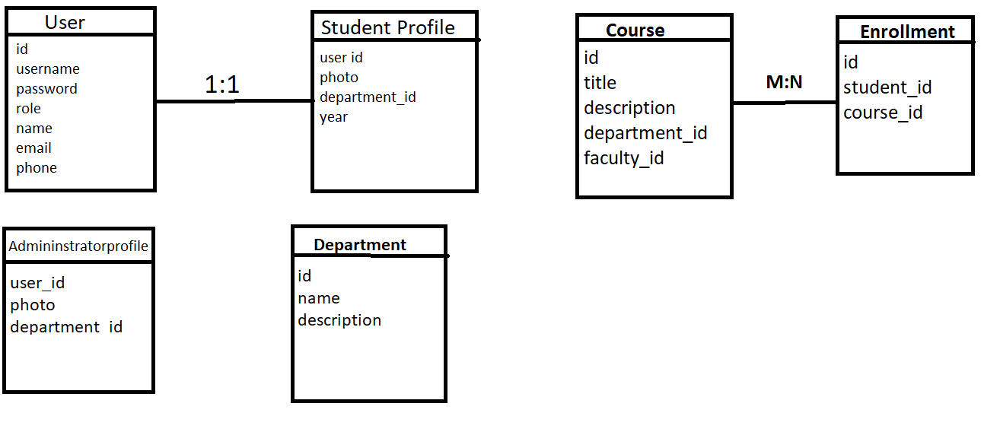

# 🎯 College Directory Application
The **College Directory Application** is a comprehensive web-based system that manages various entities within a college environment, such as students, faculty, and administrators. The platform allows users to interact with a centralized database to manage student profiles, faculty information, and administrative operations like searching and managing records. The application supports multiple roles including **Student**, **Faculty Member**, and **Administrator**, each with specific privileges.

The system uses **Spring Boot** for backend services, **React.js** for the frontend interface, and **PostgreSQL** for database management. It also integrates **JWT (JSON Web Tokens)** for authentication and role-based access control, ensuring that users can only access resources appropriate to their roles.

---

## Tech Stack

The following technologies and tools were used to build this project:

### Backend:
- **Spring Boot** - A Java-based framework used for building the backend RESTful APIs.
- **Spring Data JPA** - Provides ORM support for managing database records with Java Persistence API.
- **Spring Security** - Handles authentication and authorization within the application.
- **PostgreSQL** - The relational database used for storing all data.
- **JWT (JSON Web Tokens)** - Used for stateless user authentication.

### Frontend:
- **React.js** - A JavaScript library for building user interfaces.
- **Axios** - For making HTTP requests from React to the Spring Boot API.
- **CSS** - For styling the user interface.

---

## Features

### 1. **User Roles**:
- **Students** can view and update their profiles and search for other students.
- **Faculty Members** can view their profiles, manage their student list, and search for students.
- **Administrators** can manage both student and faculty records.

### 2. **Authentication and Authorization**:
- Uses **JWT** for token-based authentication.
- **Spring Security** ensures role-based access control, protecting API endpoints.

### 3. **API Endpoints**:
The application provides multiple RESTful API endpoints for interacting with student, faculty, and administrator data.
# API Endpoints
## Authentication API (`UserController`)

### 1. **Login API**

- **Endpoint**: `POST /api/auth/login`
- **Description**: Authenticates the user and provides a JWT token.
  
- **Request**:
  - `username`: The user's unique username.
  - `password`: The user's password.
  
- **Response (Success)**:
  - `token`: A JWT token string to be used for authenticated requests.
  - `role`: The user's role (`STUDENT`, `FACULTY_MEMBER`, `ADMINISTRATOR`).

- **Response (Error)**:
  - `message`: Error message indicating invalid username or password.

---

### 2. **Register API**

- **Endpoint**: `POST /api/auth/register`
- **Description**: Registers a new user.
  
- **Request**:
  - `username`: Unique username for the new user.
  - `password`: Password for the new user.
  - `role`: The role of the user (e.g., `STUDENT`, `FACULTY_MEMBER`, `ADMINISTRATOR`).
  - `email`: Email address of the user.
  - `name`: Full name of the user.
  
- **Response (Success)**:
  - `message`: Confirmation message indicating that the user was registered successfully.

---

## Student API (`StudentController`)

### 1. **Get Student Profile**

- **Endpoint**: `GET /api/student/profile/{id}`
- **Description**: Fetches the student profile by ID.
- **Authorization**: Bearer token required (STUDENT role).

- **Response**:
  - `id`: Student ID.
  - `name`: Full name of the student.
  - `email`: Email address of the student.
  - `department`: Object containing the department name.
  - `year`: The current year of the student.

---

### 2. **Update Student Profile**

- **Endpoint**: `PUT /api/student/profile`
- **Description**: Updates the student's profile.
- **Authorization**: Bearer token required (STUDENT role).

- **Request**:
  - `id`: Student ID.
  - `name`: Full name of the student.
  - `email`: Email address of the student.
  - `department`: Department object containing department name.
  - `year`: The current year of the student.

- **Response (Success)**:
  - `message`: Confirmation message indicating that the profile was updated successfully.

---

### 3. **Search Students**

- **Endpoint**: `GET /api/student/search?name={name}&department={department}`
- **Description**: Search for students by name or department.
- **Authorization**: Bearer token required.

- **Response**:
  - A list of student objects containing:
    - `id`: Student ID.
    - `name`: Full name of the student.
    - `email`: Email address of the student.
    - `department`: Object containing the department name.
    - `year`: The current year of the student.

---

## Faculty API (`FacultyController`)

### 1. **Get Faculty Profile**

- **Endpoint**: `GET /api/faculty/profile/{id}`
- **Description**: Fetches the faculty profile by ID.
- **Authorization**: Bearer token required (FACULTY_MEMBER role).

- **Response**:
  - `id`: Faculty ID.
  - `name`: Full name of the faculty member.
  - `email`: Email address of the faculty member.
  - `department`: Object containing the department name.
  - `officeHours`: Office hours of the faculty member.

---

### 2. **Update Faculty Profile**

- **Endpoint**: `PUT /api/faculty/profile`
- **Description**: Updates the faculty member's profile.
- **Authorization**: Bearer token required (FACULTY_MEMBER role).

- **Request**:
  - `id`: Faculty ID.
  - `name`: Full name of the faculty member.
  - `email`: Email address of the faculty member.
  - `department`: Object containing department name.
  - `officeHours`: Office hours of the faculty member.

- **Response (Success)**:
  - `message`: Confirmation message indicating that the profile was updated successfully.

---

## Admin API (`AdminController`)

### 1. **Get All Students**

- **Endpoint**: `GET /api/admin/students`
- **Description**: Fetches a list of all students.
- **Authorization**: Bearer token required (ADMIN role).

- **Response**:
  - A list of student objects containing:
    - `id`: Student ID.
    - `name`: Full name of the student.
    - `email`: Email address of the student.
    - `department`: Object containing the department name.
    - `year`: The current year of the student.

---

### 2. **Get All Faculty**

- **Endpoint**: `GET /api/admin/faculty`
- **Description**: Fetches a list of all faculty members.
- **Authorization**: Bearer token required (ADMIN role).

- **Response**:
  - A list of faculty objects containing:
    - `id`: Faculty ID.
    - `name`: Full name of the faculty member.
    - `email`: Email address of the faculty member.
    - `department`: Object containing the department name.
    - `officeHours`: Office hours of the faculty member.
## Database Tables
## ER DIAGRAM
## 

